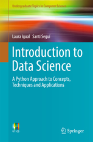

# Data Science and Big Data Postgraduate Course at Universitat de Barcelona, 2019-20

Data Science and Big Data
course offers students a program that covers the concepts and tools you will need throughout the entire data science pipeline: asking the right questions; wrangling and cleaning data; generating hypothesis; making inferences; visualizing data; assessing solutions; and building data products.

The program is specially designed for students with a background in computer science, mathematics, and applied statistics, but other scientific and engineering backgrounds can be considered.

We will require to follow lessons and complete class exercises using personal laptops. You will not be able to complete all your assignments in class if you rely solely on desktop equipment at home.

Before the first class you need to:

+ Install Anaconda Python 3.6 version: Anaconda Distribution is a free, easy-to-install package manager, environment manager and Python distribution with a collection of over 720 open source packages with free community support.
+ Have a (free) account at GitHub: GitHub is a web-based Git or version control repository and Internet hosting service. It offers all of the distributed version control and source code management (SCM) functionality of Git as well as adding its own features.

## Instructors

Laura Igual, Petia Radeva, Oriol Pujol, Jordi Vitrià, Lluis Garrido, Albert Díaz-Guileras, Eloi Puertas, Santi Seguí, Josep Perelló, Montse Guillen, Mireia Ribera.
`
## Collaborations

 

## Calendar
Google Calendar Link:
https://calendar.google.com/calendar/embed?src=q30tlenjjfgor26u47hs3ugf28%40group.calendar.google.com&ctz=Europe%2FMadrid

| Date        | Session           | 
| :-------------: | ------------- | 
| dt. 1 Oct. 2019      | Introduction, Jordi Vitrià |  
| dj. 3 Oct. 2019	| Python, Eloi Puertas | 
| dt. 8 Oct. 2019	| Data Science Toolbox, Eloi Puertas | Data Gathering, Oriol Pujol |
| dj. 10 Oct. 2019	| Data Science Toolbox, Eloi Puertas |
| dt. 15 Oct. 2019	| Software Carpentry, Eloi Puertas | 
| dj. 17 Oct. 2019	| Practical Session, Eloi Puertas |
| dt. 22 Oct. 2019	| Data Gathering, Oriol Pujol |
| dj. 24 Oct. 2019 (18.30h)	| MasterClass1 - KING Games |
| dt. 29 Oct. 2019	| Data Gathering, Oriol Pujol |
| dt. 5 Nov. 2019	| Textual Data Analysis, Santi Seguí |
| dj. 7 Nov. 2019	| Computational Statistics, Petia Radeva |
| dt. 12 Nov. 2019	| Textual Data Analysis, Santi Seguí |
| dj. 14 Nov. 2019	| Statistical Estimation, Jordi Vitrià |
| dt. 19 Nov. 2019	| Regression, Laura Igual | 
| dj. 21 Nov. 2019	| Regression, Laura Igual | 
| dt. 26 Nov. 2019	| Statistics with R, Montse Guillen |
| dj. 28 Nov. 2019	| MasterClass2 - NESTLE | 
| dt.  3 Dec. 2019	| Statistics with R, Montse Guillen |
| dt. 10 Dec. 2019	| Visualization, Mireia Ribera |
| dj. 12 Dec. 2019	| Visualization, Mireia Ribera |
| dt. 17 Dec. 2019	| MasterClass3 -  |
| dt.  7 Jan. 2020	| Bayesian Estimation, Jordi Vitrià |
| dj. 9 Jan. 2020	| Bayesian Estimation, Jordi Vitrià |
| dt. 14 Jan. 2020	| Supervised Learning, Oriol Pujol |
| dj. 16 Jan. 2020	| Supervised Learning, Oriol Pujol |
| dt. 21 Jan. 2020	| Supervised Learning, Oriol Pujol |
| dj. 23 Jan. 2020	| Supervised Learning, Oriol Pujol |
| dt. 28 Jan. 2020	| Unsupervised Learning, Petia Radeva | 
| dj. 30 Jan. 2020	| Unsupervised Learning, Petia Radeva | 
| dt. 4 Feb. 2020	  | Deep Learning, Jordi Vitrià | 
| dj. 6 Feb. 2020	  | Deep Learning, Jordi Vitrià | 
| dt. 11 Feb. 2020	| Causal Data Science, Jordi Vitrià |
| dj. 13 Feb. 2020	| Practical Session, Santi/Jordi/Oriol |
| dt. 18 Feb. 2020	| MasterClass4,  |
| dj. 20 Feb. 2020	| Recommenders, Santi Seguí |
| dt. 25 Feb. 2020	| Recommenders, Santi Seguí |
| dj. 27 Feb. 2020	| Graph Analysis, Laura Igual |

| dt. 3 Mar. 2020	  | Graph Analysis, Laura Igual |
| dj. 5 Mar. 2020	  | Complex Networks, Albert Diaz-Gilera |
| dt. 10 Mar. 2020	| Algorithmic Discrimination, Carlos Castillo |
| dj. 12 Mar. 2020	| Multi Core Computing, Lluís Garrido|
| dt. 17 Mar. 2020	| BigData, -- |
| dj. 19 Mar. 2020	| BigData, --|
| dt. 24 Mar. 2020	| Cloud - Microsoft Azure, Tiago Henriques |
| dj. 26 Mar 2020	  | Cloud - Microsoft Azure, Tiago Henriques |
| dj. 31 Mar 2020	  | DataCrowsourcing, Josep Perello |
| dj. 2 Apr. 2020	  | Capstone Project |
| dj. 7 May. 2020	| Master Class  |
| dj. 21 May. 2020	| Capstone Project  |
| Dt. 2  Jul. 2020	| Capstone Project Presentations |

## Book Companion

Parts of the presented materials in the postgraduate course of Data Science and Big Data from Universitat de Barcelona have been used in the recently published ["Introduction to Data Science: A Python Approach to Concepts, Techniques and Applications"](http://www.springer.com/gp/book/9783319500164) book. This book is accompanied by a set of IPython Notebooks containing all the codes necessary to solve the practical cases of the book. The Notebooks can be found on the following GitHub repository: https://github.com/DataScienceUB/introductiondatascience-python-book. 

 

